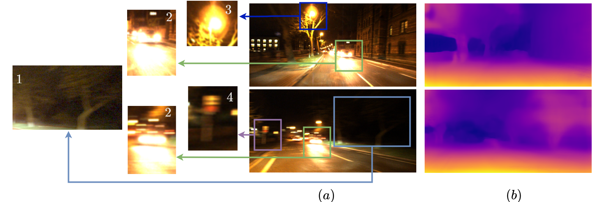

# AllDay-DeMoN
This codebase implements the system described in the paper:

> **When the Sun Goes Down: Repairing Photometric Losses for All-Day Depth Estimation**
>
> Madhu Vankadari, Stuart Golodetz, Sourav Garg, Sangyun Shin, Andrew Markham, Niki Trigoni
>
> [(*CORL, 2022*)](https://arxiv.org/abs/2206.13850)

<p align="center">
  
</p>

```diff 
+ Update: This work is going to be appeared in the proceedings of Conference on Robot Learning (CORL),2022.

```

Currently, the paper is under review. We would like to make the training and testing scripts open source once the paper is accpeted. Meanwhile, if any of the content in this repo or the paper is useful in your research, please consider citing our work:

```
@article{vankadari2022sun,
  title={When the Sun Goes Down: Repairing Photometric Losses for All-Day Depth Estimation},
  author={Vankadari, Madhu and Golodetz, Stuart and Garg, Sourav and Shin, Sangyun and Markham, Andrew and Trigoni, Niki},
  journal={arXiv preprint arXiv:2206.13850},
  year={2022}
}
```

## Dataset

We evaluated our method’s performance on both day and night sequences from the [Oxford RobotCar dataset](https://robotcar-dataset.robots.ox.ac.uk/datasets/). This dataset was collected over a one-year period by traversing the same route multiple times so as to include a variety of different weather and lighting conditions. 

We used the 2014-12-09-13-21-02 traversal for our daytime experiments,the 2014-12-16-18-44-24 traversal for our nighttime.

To split the traversal into train,val and test splits, please run the following

```bash
python3 data/getOxSplits.py -p <dir path> -t <traverse id> -s <split> -d -o <offset>
```

For example, the generate training split for the night-time traverse 2014-12-16-18-44-24 with an image offset distance as 0.01m, run
```bash
python3 data/getOxSplits.py -p traverses -t 2014-12-16-18-44-24 -s train -d -o 0.01
```

We are also adding the data splits used to train and test our model in the paper here, please use them to compare against our model until we release the code and pretrianed models.


